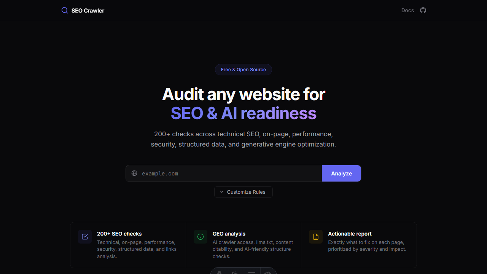
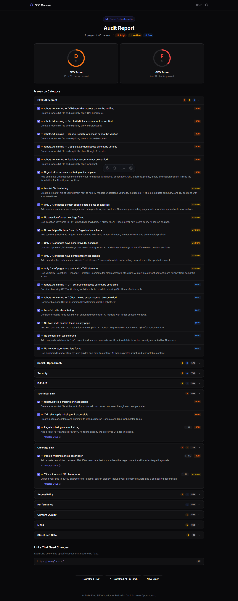
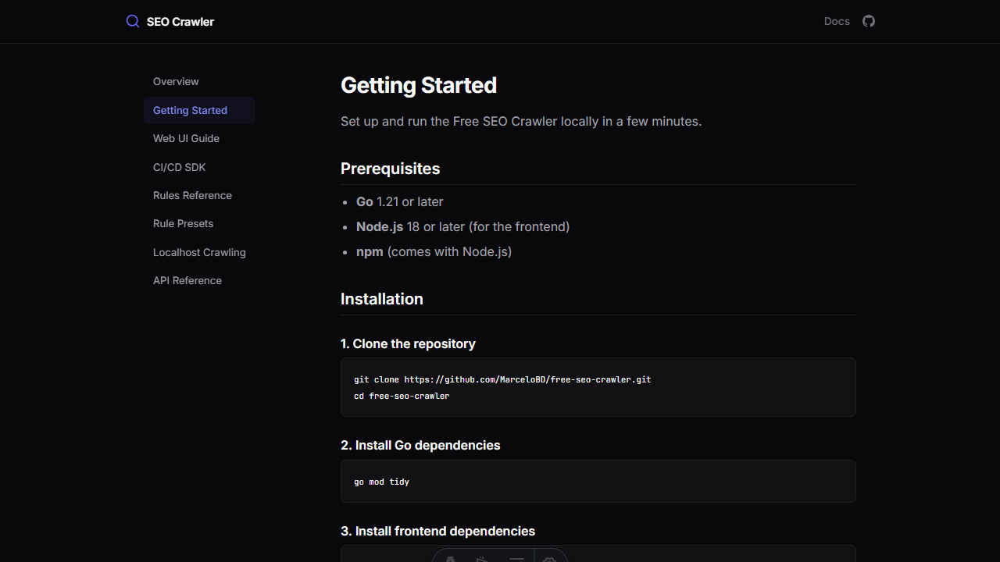

<p align="center">
  
</p>

<h1 align="center">Free SEO & GEO Crawler</h1>

<p align="center">
  <strong>Open-source website auditor for SEO and AI search readiness</strong>
</p>

<p align="center">
  <a href="https://github.com/booltools/booltools-seo-crawler/actions/workflows/ci.yml"></a>
  <a href="https://github.com/booltools/booltools-seo-crawler/blob/master/LICENSE"></a>
  <a href="https://github.com/booltools/booltools-seo-crawler/releases"></a>
  
  
</p>

<p align="center">
  <a href="https://booltools.github.io/booltools-seo-crawler/">Website</a> •
  <a href="#quick-start">Quick Start</a> •
  <a href="#features">Features</a> •
  <a href="#screenshots">Screenshots</a> •
  <a href="#cicd-sdk">CI/CD SDK</a> •
  <a href="#api-reference">API</a> •
  <a href="#contributing">Contributing</a>
</p>

---

Analyze any website for **130+ checks** across technical SEO, on-page optimization, performance, security, structured data, and **generative engine optimization (GEO)**. Get actionable reports with fix instructions, export them for your team or feed them directly to AI agents.

Built with **Go** (backend) and **Astro** (frontend). Includes a **CI/CD SDK** to catch SEO regressions before they reach production.

## Features

- **130+ audit rules** across 15 categories
- **GEO (Generative Engine Optimization)** — AI crawler access, llms.txt, content citability, entity authority
- **Real-time progress** — watch issues appear live as pages are crawled via Server-Sent Events
- **Rule presets** — Full Scan, Essential, Blog, E-Commerce, Video, Landing Page, Technical-only, GEO-only
- **Customizable rules** — select/deselect individual rules before analysis
- **Export reports** as CSV or Markdown (AI-agent-friendly format)
- **CI/CD SDK** — standalone CLI binary for deployment pipelines
- **Localhost crawling** — test your dev server before deploying
- **Full sitemap analysis** — validates all URLs, detects orphan pages, broken links, redirects
- **Completion sound** — subtle audio notification when analysis finishes
- **Docker deployment** with multi-stage build

## Screenshots

### Audit Report

<p align="center">
  
</p>

### Documentation

<p align="center">
  
</p>

## Quick Start

### Prerequisites

- **Go** 1.21+
- **Node.js** 20+

### Install and run

```bash
git clone https://github.com/booltools/booltools-seo-crawler.git
cd booltools-seo-crawler

# Install dependencies
go mod tidy
cd web && npm install && cd ..

# Terminal 1 — Backend (port 8080)
make dev

# Terminal 2 — Frontend (port 4321)
make web-dev
```

Open **http://localhost:4321** in your browser.

### Run with Docker

```bash
docker compose up --build
```

## How It Works

1. Enter a domain (e.g. `example.com` or `localhost:3000`)
2. Optionally select a **rule preset** or pick individual rules
3. Click **Analyze** — watch real-time progress with live issues
4. Review the report grouped by category with severity indicators
5. **Export** as CSV or Markdown — uncheck irrelevant rules before exporting

## Architecture

```
booltools-seo-crawler/
├── cmd/
│   ├── server/              # Web server entry point
│   └── seo-crawler/         # CLI/SDK binary
├── internal/
│   ├── api/                 # HTTP handlers, router, middleware
│   ├── application/         # Use cases, DTOs
│   ├── domain/              # Entities, value objects, repository interfaces
│   └── infrastructure/
│       ├── analyzer/        # 130+ rule implementations by category
│       ├── crawler/         # Colly-based web crawler
│       ├── persistence/     # SQLite repository
│       └── queue/           # Worker pool, SSE progress broker
├── tests/                   # Unit tests (mirrors internal/ structure)
├── web/                     # Astro frontend (SSR)
├── .github/                 # CI workflows, PR/issue templates
├── Dockerfile
└── Makefile
```

| Layer       | Technology                             |
| ----------- | -------------------------------------- |
| Backend     | Go, Chi router, Colly crawler, Goquery |
| Database    | SQLite (modernc.org/sqlite, WAL mode)  |
| Frontend    | Astro SSR with @astrojs/node           |
| Concurrency | Goroutines, worker pool, SSE streaming |
| SDK         | Standalone Go CLI binary               |

## Audit Categories

| Category             | Rules  | Checks                                                                           |
| -------------------- | :----: | -------------------------------------------------------------------------------- |
| On-Page SEO          |   15   | Title, meta description, headings, images, alt text                              |
| Content              |   2    | Word count, text-to-HTML ratio                                                   |
| Technical SEO        |   24   | Canonical, robots.txt, sitemap, redirects, HTTP status                           |
| Links                |   6    | Internal/external links, broken links, anchor text                               |
| Performance          |   9    | Page size, TTFB, compression, render blocking, HTTP requests                     |
| Structured Data      |   3    | JSON-LD, breadcrumbs, schema validation                                          |
| Security             |   9    | HTTPS, HSTS, CSP, XFO, security headers                                          |
| Accessibility        |   5    | Language, viewport, ARIA labels                                                  |
| Social / Open Graph  |   12   | OG tags, Twitter cards                                                           |
| Mobile               |   2    | Viewport, touch targets                                                          |
| URL Structure        |   6    | Lowercase, length, special characters                                            |
| Internationalization |   2    | Hreflang validation                                                              |
| E-E-A-T              |   6    | Author, about, contact, privacy pages                                            |
| Duplicate Content    |   3    | Duplicate titles, descriptions, body                                             |
| **GEO**              | **24** | AI crawler access, llms.txt, citability, entity authority, AI-friendly structure |

## Rule Presets

| Preset             | Description                           |
| ------------------ | ------------------------------------- |
| Full Scan          | All 130+ rules                        |
| Essential          | Core SEO checks every site needs      |
| Blog / Article     | Content-heavy sites and blogs         |
| E-Commerce         | Product pages and transactional sites |
| Video Platform     | Video-centric sites                   |
| Landing Page       | Single-page marketing sites           |
| Technical SEO      | Infrastructure and crawlability only  |
| GEO / AI Readiness | AI search optimization only           |

## CI/CD SDK

Catch SEO regressions in your deployment pipeline with the standalone CLI.

### Build

```bash
make build-sdk
# Output: bin/seo-crawler
```

### Usage

```bash
# Scan a running server
seo-crawler --mode=full --url=http://localhost:3000

# Auto-start server, scan, then stop
seo-crawler \
  --mode=full \
  --start-cmd="npm run dev" \
  --wait-for=http://localhost:3000 \
  --url=http://localhost:3000 \
  --fail-on=high

# Scan static HTML files
seo-crawler --mode=static --dir=./dist
```

### Multiple Servers

When your app has separate frontend and backend, start both and wait for all:

```yaml
# .seo-crawler.yml
mode: full
url: http://localhost:3000
start_cmd:
  - "go run ./cmd/server"
  - "cd web && npm run dev"
wait_for:
  - http://localhost:8080/api/health
  - http://localhost:3000
wait_timeout: 90s
fail_on: high
```

Or via CLI: `--start-cmd="cmd1,cmd2" --wait-for="url1,url2"`

### Configuration

Create `.seo-crawler.yml` in your project root:

```yaml
mode: full
url: http://localhost:3000
start_cmd: "npm run dev"
wait_for: http://localhost:3000
wait_timeout: 60s
fail_on: high
max_pages: 100
format: text
ignore:
  - uses_https
  - hsts_header
```

### GitHub Actions (Marketplace Action)

The easiest way — use the official [Marketplace action](https://github.com/marketplace/actions/booltools-seo-crawler):

```yaml
name: SEO Audit
on: [pull_request]

jobs:
  seo:
    runs-on: ubuntu-latest
    steps:
      - uses: actions/checkout@v4
      - uses: actions/setup-node@v4
        with:
          node-version: "22"
      - run: npm ci

      - name: Run SEO audit
        uses: booltools/booltools-seo-crawler@v0
        with:
          mode: full
          url: http://localhost:3000
          start-cmd: "npm run dev"
          wait-for: http://localhost:3000
          fail-on: high
```

For static HTML sites (no server needed):

```yaml
      - name: Run SEO audit
        uses: booltools/booltools-seo-crawler@v0
        with:
          mode: static
          dir: ./dist
          fail-on: high
```

### GitHub Actions (Manual Binary)

If you prefer downloading the binary directly:

```yaml
name: SEO Audit
on: [pull_request]

jobs:
  seo:
    runs-on: ubuntu-latest
    steps:
      - uses: actions/checkout@v4
      - uses: actions/setup-node@v4
        with:
          node-version: "22"
      - run: npm ci

      - name: Download SEO Crawler SDK
        run: |
          curl -sL https://github.com/booltools/booltools-seo-crawler/releases/latest/download/seo-crawler-linux-amd64 -o seo-crawler
          chmod +x seo-crawler

      - name: Run SEO audit
        run: |
          ./seo-crawler \
            --mode=full \
            --start-cmd="npm run dev" \
            --wait-for=http://localhost:3000 \
            --url=http://localhost:3000 \
            --fail-on=high
```

### CLI Flags

| Flag             | Description                                              | Default |
| ---------------- | -------------------------------------------------------- | ------- |
| `--mode`         | `static` or `full`                                       | —       |
| `--dir`          | HTML directory (static mode)                             | —       |
| `--url`          | Server URL (full mode)                                   | —       |
| `--fail-on`      | Severity threshold (`critical`, `high`, `medium`, `low`) | `high`  |
| `--ignore`       | Comma-separated rule keys to skip                        | —       |
| `--only`         | Comma-separated rule keys to run                         | —       |
| `--start-cmd`    | Commands to start servers (comma-separated for multiple) | —       |
| `--wait-for`     | URLs to poll until ready (comma-separated for multiple)  | —       |
| `--wait-timeout` | Max wait time per URL (e.g. `30s`, `1m`)                 | `30s`   |
| `--format`       | `text` or `json`                                         | `text`  |
| `--output`       | Write JSON report to file                                | —       |
| `--max-pages`    | Max pages to crawl (0 = unlimited)                       | `0`     |

### Exit Codes

| Code | Meaning                                 |
| ---- | --------------------------------------- |
| `0`  | All checks pass                         |
| `1`  | Issues at or above `--fail-on` severity |
| `2`  | Configuration error                     |

## API Reference

| Method | Endpoint                     | Description            |
| ------ | ---------------------------- | ---------------------- |
| `POST` | `/api/crawl`                 | Start a new crawl      |
| `GET`  | `/api/crawl/:id/progress`    | SSE progress stream    |
| `GET`  | `/api/report/:id`            | Full audit report      |
| `GET`  | `/api/report/:id/export/csv` | Export as CSV          |
| `GET`  | `/api/report/:id/export/md`  | Export as Markdown     |
| `GET`  | `/api/rules`                 | List rules and presets |
| `GET`  | `/api/health`                | Health check           |

**Start a crawl:**

```bash
curl -X POST http://localhost:8080/api/crawl \
  -H "Content-Type: application/json" \
  -d '{"domain": "example.com"}'
```

## Development

```bash
make build          # Build backend binary
make build-sdk      # Build SDK CLI
make build-all      # Build both
make dev            # Run backend (dev mode)
make test           # Run all tests
make lint           # Run go vet
make tidy           # Run go mod tidy
make web-dev        # Start frontend dev server
make web-build      # Build frontend for production
make clean          # Remove build artifacts
```

> **Windows:** install Make with `winget install GnuWin32.Make`

## Documentation

When running the app, full documentation is available at `/docs`:

- **Overview** — features and architecture
- **Getting Started** — installation and setup
- **Web UI Guide** — using the web interface
- **CI/CD SDK** — pipeline integration
- **Rules Reference** — all 130+ rules with examples and fix instructions
- **Rule Presets** — preset details
- **Localhost Crawling** — testing local development servers
- **API Reference** — REST API endpoints

## Contributing

Contributions are welcome! Please read [CONTRIBUTING.md](CONTRIBUTING.md) for guidelines on:

- Setting up the development environment
- Adding new audit rules
- Code style and conventions
- Pull request process

See the [issue templates](.github/ISSUE_TEMPLATE/) for reporting bugs, requesting features, or proposing new rules.

## License

This project is licensed under the MIT License — see the [LICENSE](LICENSE) file for details.
